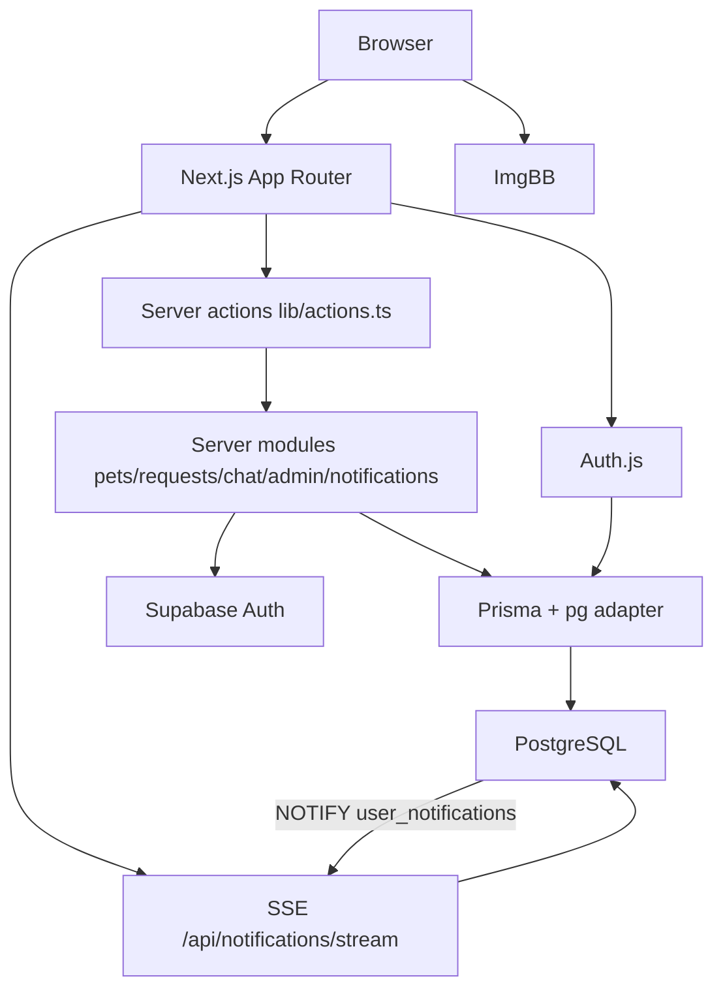
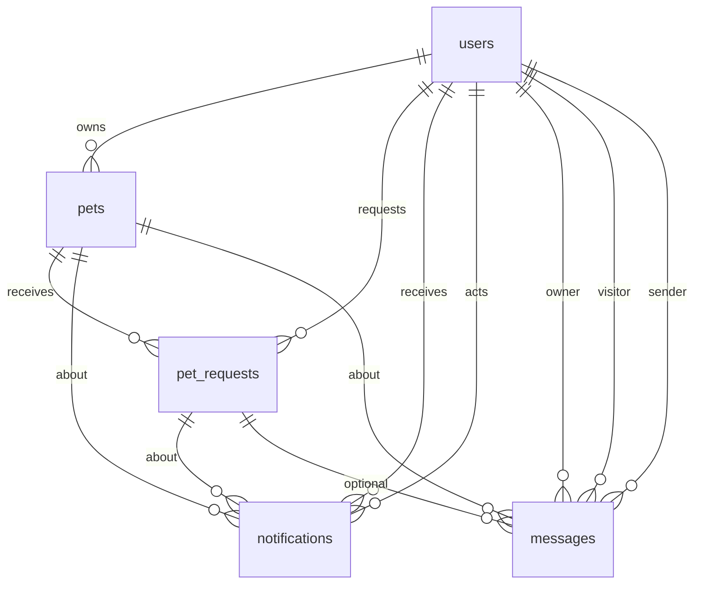

# Paws Safe

**Connecting pets with loving homes.**

A peer-to-peer web application for listing pets for **adoption** or temporary **foster** care, requesting a pet, and chat owners.

    

---

## Overview

Paws Safe is a connecting platform, not a shelter. Owners who cannot keep a pet publish a listing. People who want to adopt or foster browse by listing type, country, and category, then submit a structured request. Until the owner approves that request, email and phone stay hidden.

The application is a **Next.js App Router** full-stack app. UI and routing live in `app/` and `components/`. Mutations and privileged reads run as **server actions** and **server-only modules** against **PostgreSQL** via **Prisma**. **Auth.js (NextAuth v5)** owns sessions. **Supabase Auth** is used only to send and confirm signup emails. Pet photos are uploaded to **ImgBB**; the stored URL is saved on the listing.

**Intended users**

- Pet owners posting adoption or foster listings
- People requesting a pet
- Site admins who manage users and listings
- Visitors browsing public pages (home, listings, contact, terms)

---

## Goals & Objectives

- Give owners a single place to post adoption or foster listings, including urgent cases.
- Let seekers filter listings and apply with household/experience details.
- Keep contact information private until an owner approves a request.
- Notify owners and requesters of request outcomes and chat messages.
- Let signed-in, email-verified users message a listing owner or poster profile.
- Let admins review, edit, and delete users and listings.

---

## Features

### Public site

- Home page: hero, how it works, urgent listings, donation details, stats, contact form.
- Adoption (`/adoption`) and foster (`/foster`) listings with country and category filters (client-side on the server-fetched list).
- Pet detail (`/pets/[id]`): care notes, poster card, request CTA, chat with the owner when allowed.
- Public poster profile (`/users/[id]`).
- Contact page and home contact form: **demo only** — submit shows a success toast; nothing is stored or emailed.
- Donation section: static bank-style fields (placeholder values).
- Terms page.
- Light/dark theme (cookie + `localStorage`, key `paws-theme`).

### Authentication

- Email/password signup (bcrypt) and login (Auth.js Credentials).
- Google OAuth; Google accounts are marked email-verified and synced into `users`.
- Complete-profile page when phone, country, or city is missing (typical after Google).
- Email confirmation via Supabase Auth (`/verify-email`, `/auth/confirm`).
- Unverified users cannot request pets, open `/profile`, or start chat as a visitor.
- Logout via Auth.js `signOut`.

### Listings & requests

- Multi-step post/edit form (`/post-pet`, `/profile/pets/[id]`, admin pet edit).
- Listing type: `adoption` or `foster`. Optional `emergency` flag.
- Photo: client upload to ImgBB, then URL saved on `pets.img`.
- One pending request per user per pet (`unique (pet_id, requester_id)`).
- Request questionnaire (household, other pets, experience, finances, foster duration when needed).
- Owner approve/decline with a confirmation modal. Approving a request marks the pet matched (`requested = true`) and rejects other pending requests for that pet.
- Requester can withdraw a pending request.
- Street address is collected on the listing; contact email/phone of the poster are shown only to the owner or an approved requester.

### Chat

- Direct messages between an owner and a visitor (`messages.owner_id` / `visitor_id`), optional `pet_id`.
- Open from the listing poster card, public profile, incoming/outgoing request rows, or the inbox FAB.
- Thread load matches either orientation of the pair so existing history is found.
- Inbox FAB appears after the user has received at least one message.
- Polling (~4–5s) for thread and inbox; opening a thread marks that peer’s message notifications read.
- Message notifications are suppressed (no sound, no unread badge) while that thread is open.

### Notifications

- Types used in writes: `request`, `approval`, `denied`, `message`.
- Header bell: REST fetch plus SSE (`LISTEN user_notifications`) with polling fallback.
- Unread badge, mark one/all read, clear all.
- Client chime on new unread items (after a user gesture unlocks audio).

### Administration

- `/admin` is login-gated in the Auth.js proxy, then **role-checked in the database** (`requireAdmin`).
- Dashboard: counts, searchable pet and user tables, edit/delete/view.
- Admins can edit any listing, delete listings, edit users (including role and email-verified), and delete users (not self; cannot remove the last admin).
- Admin pages send `robots: noindex`.

### Contact (demo)

Submitting Contact Us resets the form and shows a bottom-right in-app toast. No backend action.

---

## User Roles & Permissions

| Role | Access |
| ---- | ------ |
| Anonymous | Browse home, listings, pet pages, public profiles, contact, terms. Cannot request, post, chat, or see poster contact. |
| `user` | All of the above plus signup/login. After email verification: request pets, chat (not as listing owner restriction for visitors), manage own profile/listings/requests. Contact on others’ profiles/listings only after an **approved** request with that owner. |
| `admin` | Everything a user can do, plus `/admin`, edit/delete any listing, edit/delete other users, chat without email verification on the visitor path. Admins are treated as “verified” on poster badges. |

**Enforcement**

- Route gate: `proxy.ts` → Auth.js `authorized` (logged-in vs public). `/admin` only requires a session there; **admin role is not visible to the edge auth config**.
- Page gate: `requireAdmin()` reads `users.role`.
- Mutation gate: session `user.id` plus owner match or `userHasAdminRole()`.
- Data gate: poster email/phone stripped unless owner or approved requester.

`users.verification_status` (`pending` / `approved` / `rejected`) drives a **Verified** badge when `approved`. There is no implemented ID-upload or admin workflow that changes this field.

---

## Technology Stack

| Category | Technology | Purpose |
| -------- | ---------- | ------- |
| Framework | Next.js 16 (App Router), React 19 | Pages, RSC, server actions, route handlers |
| Language | TypeScript | Application code |
| ORM | Prisma 7 (`prisma-client` + `@prisma/adapter-pg`) | Postgres access; client generated to `lib/generated/prisma` |
| Database | PostgreSQL | Users, pets, requests, notifications, messages |
| Hosting (typical) | Supabase Postgres | Schema via SQL migrations in `supabase/migrations/` |
| Auth sessions | Auth.js 5 (`next-auth`) | Credentials + Google, JWT session |
| Email confirm | `@supabase/supabase-js` Auth | Signup/resend/verify OTP or token |
| Styling | Tailwind CSS 4, CSS files under `app/` | Layout and theming |
| Icons / fonts | lucide-react, Google fonts Nunito + Outfit | UI |
| Validation | Zod | Signup, pets, requests, admin user update |
| Passwords | bcrypt | Hash and compare |
| Images | ImgBB HTTP API | Pet photo hosting |
| Realtime notify | Postgres `LISTEN/NOTIFY` + `pg` | Notification SSE |
| Seed | `scripts/seed.mjs` | Demo data via Supabase service role |

Auth.js environment variables (e.g. `AUTH_SECRET`, Google client id/secret) are required at runtime even though `.env.example` currently lists only Supabase keys.

---

## System Architecture



- **Client**: React components, theme, chat dock, notification bell, listing filters.
- **Server**: RSC pages fetch via `lib/*-server.ts`. Mutations go through `'use server'` actions that call `auth()` then domain functions.
- **Auth.js** issues the session cookie; JWT is refreshed with `email_verified` and `role` from the DB.
- **Prisma** is the runtime data path. SQL in `supabase/migrations/` is the schema source for the hosted database.
- **Supabase Auth** is not the session system; it only delivers verification email flows.
- **ImgBB** is called from the browser; the app stores the returned URL.

---

## Application Flow

### Authentication flow

```text
Sign up
  → Zod validate
  → bcrypt hash
  → INSERT users (email_verified = false)
  → Supabase auth.signUp (verification email)
  → Auth.js signIn credentials
  → JWT + session cookie
  → /verify-email until confirmed

Login
  → Credentials authorize (email + bcrypt)
  → JWT includes id, profileComplete, isEmailVerified, role

Google
  → OAuth
  → find/create users row, email_verified = true
  → /complete-profile if phone/country/city missing

Protected page
  → proxy.ts authorized()
  → if /profile and not verified → redirect /verify-email
  → if /admin → requireAdmin() DB role check
```

### Main data flow (request a pet)

```text
User submits request form
  → requestPet server action
  → createPetRequest (Zod + rules)
  → INSERT pet_requests + notification (type request)
  → Postgres NOTIFY
  → owner SSE / poll updates bell
  → owner approve/decline
  → pet.requested, other pendings rejected, approval/denied notifications
  → approved requester sees poster contact
```

### Chat flow

```text
Chat owner / inbox row
  → ChatProvider.openThread
  → loadOwnerChat → resolve pair (either orientation) → messages
  → sendOwnerChatMessage → INSERT messages + notification type message
  → peer inbox/bell; suppressed if that thread is open
```

---

## Database Architecture

IDs for `users` and `pets` are text from `generate_base64_id()`. `pet_requests`, `notifications`, and `messages` use bigserial ids.



### `users`

| Field | Notes |
| ----- | ----- |
| `id` | PK, base64 text |
| `username`, `email` (unique), `phone`, `country`, `city` | Profile |
| `password` | Nullable (Google-only accounts) |
| `email_verified` | Signup confirmation |
| `verification_status` | Enum: pending / approved / rejected (badge only) |
| `role` | Enum: `user` / `admin` |
| `created_at` | timestamptz |

### `pets`

| Field | Notes |
| ----- | ----- |
| `id` | PK |
| `owner_id` | FK users, cascade |
| `status` | Enum: `adoption` / `foster` |
| `emergency`, `requested` | Urgent flag; matched flag |
| `category` | Stored as DB plurals (`dogs`, …); UI uses singular |
| `img` | Photo URL |
| `name`, `age`, `gender`, location, care text fields | Listing content |

Indexes: `owner_id`, `status`.

### `pet_requests`

| Field | Notes |
| ----- | ----- |
| `id` | PK |
| `pet_id`, `requester_id` | Unique together |
| `status` | pending / approved / rejected / withdrawn |
| Questionnaire + optional `full_name`, `email`, `phone`, `message` | |

### `notifications`

| Field | Notes |
| ----- | ----- |
| `user_id` | Recipient |
| `type` | request / approval / denied / message (and typed `verification`) |
| `title`, `body`, `href` | Inbox copy and link |
| `pet_id`, `request_id`, `actor_id` | Optional FKs |
| `read_at` | Null = unread |

Trigger `notifications_notify` runs `pg_notify('user_notifications', '{"user_id":...}')`.

### `messages`

| Field | Notes |
| ----- | ----- |
| `owner_id`, `visitor_id`, `sender_id` | Thread pair + author |
| `pet_id`, `request_id` | Optional |
| `body` | Max 2000 characters in app logic |

Index: `(owner_id, visitor_id, created_at)`.

Prisma comments mention RLS; **these migrations do not enable RLS**. Access control is in the application.

---

## Authentication & Authorization

| Concern | Mechanism |
| ------- | --------- |
| Authentication | Auth.js session after credentials or Google |
| Email proof | Supabase Auth email + `users.email_verified` |
| Authorization | `users.role`, ownership checks, request status |
| Login pages | `/login`, `/signup` (logged-in users redirected home) |
| Session | JWT callbacks copy `id`, `profileComplete`, `isEmailVerified`, `role` |
| Proxy | `proxy.ts` matcher skips `api`, static, images, `*.png` |

`lib/auth.ts` still has a browser `UserId` cookie helper; listing/auth flows use Auth.js sessions, not that cookie.

---

## Security

Verified in code:

- Passwords hashed with bcrypt (cost 10).
- Session required for profile, admin, mutations.
- Admin mutations re-check DB role.
- Cannot request own listing; cannot delete own admin account; last admin cannot be demoted/deleted.
- Open-redirect guard `safeInternalPath` on post-login / post-pet return paths.
- Email uniqueness handled on signup (`P2002` / existing row).
- Chat visitors must be email-verified unless admin.
- Contact details omitted from RSC payloads when the viewer is not allowed to see them.
- `.env*` gitignored. Admin routes `noindex`.
- Zod on signup, pet create/update, requests, admin user form.

Not found:

- Automated rate limiting
- RLS
- Dedicated CSRF module (Auth.js cookie sessions apply to same-origin server actions)
- Server-side virus/file scanning (photos go to ImgBB from the client)
- A documented Content-Security-Policy in `next.config.ts` (config is empty)

Do not commit ImgBB or other API keys in source.

---

## Project Structure

```text
paws-safe/
├── app/                    # Routes, layouts, CSS, API handlers
│   ├── api/auth/[...nextauth]/
│   ├── api/notifications/  # GET list + SSE stream
│   ├── adoption/ foster/ pets/[...id]/
│   ├── profile/ admin/ users/[...id]/
│   ├── login/ signup/ verify-email/ complete-profile/ auth/confirm/
│   ├── post-pet/ contact/ terms/
│   └── page.tsx            # Home
├── components/             # UI by domain (auth, pets, chat, admin, layout, …)
├── lib/                    # Server domain + shared helpers
│   ├── actions.ts          # Server actions entry
│   ├── *-server.ts         # Prisma-backed logic
│   ├── prisma.ts / supabase.ts / email-verification.ts
│   └── generated/prisma/   # Generated client (gitignored)
├── prisma/schema.prisma
├── prisma.config.ts
├── supabase/migrations/    # SQL applied on the hosted DB
├── scripts/seed.mjs
├── types/next-auth.d.ts
├── auth.ts / auth.config.ts / proxy.ts
├── public/imgs/
└── package.json
```

---

## Frontend Architecture

- **Routing**: file-based App Router. Catch-all `[...id]` plus `decodePetIdParam` for encoded ids.
- **Layouts**: root layout wraps theme and chat provider; pages compose Header + main + Footer.
- **RSC**: listings, pet detail, profile, admin, emergency strip fetch on the server.
- **Client islands**: forms, listing filters, header menu, notifications, chat, theme toggle, confirm modal, toasts.
- **State**: React `useState` / context (`ChatProvider`, `ThemeProvider`). No Redux/React Query.
- **Loading**: `loading.tsx` and skeleton components for listings, pet detail, profile, admin, header.
- **Not found**: `pets/[...id]/not-found.tsx`, `users/[...id]/not-found.tsx`.
- **Filters**: country + category on the already-loaded array (`matchesCategory`, `countCategories`).

---

## Backend Architecture

There is no separate API server. Next.js is the backend.

| Layer | Location |
| ----- | -------- |
| HTTP | `app/api/*`, Auth.js handlers |
| Commands | `lib/actions.ts` |
| Domain | `pets-server`, `requests-server`, `chat-server`, `admin-server`, `notifications-server` |
| Email | `email-verification.ts` + `createSupabaseAnon()` |
| Cache | `react.cache` on `fetchPetById` / `fetchUserProfile`; `revalidatePath` after writes |

Errors are returned as `{ message, errors? }` or `{ ok: false }` rather than a global error map. Server logs use `console.error`.

---

## API Reference

| Method | Endpoint | Description | Auth |
| ------ | -------- | ----------- | ---- |
| GET, POST | `/api/auth/[...nextauth]` | Auth.js (login, callback, session, CSRF) | Cookie |
| GET | `/api/notifications` | `{ notifications: AppNotification[] }` | Session; 401 → empty list |
| GET | `/api/notifications/stream` | SSE of the same payload; ping; LISTEN or poll | Session; 401 Unauthorized |

All other writes use server actions (not REST), including `signUp`, `authenticate`, `completeProfile`, `postPet`, `updatePet`, `deletePet`, `requestPet`, `reviewPetRequest`, `withdrawPetRequest`, notification and chat helpers, and admin CRUD.

`AppNotification`: `id`, `type`, `title`, `body`, `href`, `createdAt`, `unread`, `actorId`.

---

## External Services & Integrations

| Service | Purpose | Where |
| ------- | ------- | ----- |
| PostgreSQL (commonly Supabase) | Primary data | Prisma `DATABASE_URL`; SSE `DIRECT_URL` or `DATABASE_URL` |
| Supabase Auth | Verification emails | `lib/supabase.ts`, `lib/email-verification.ts` |
| Google OAuth | Social login | Auth.js `Google` provider, `GoogleAuthButton` |
| ImgBB | Pet image hosting | `PostPetForm` client upload |
| Google Fonts | Nunito, Outfit | `app/layout.tsx` |

---

## Data Management

- **Read**: RSC + Prisma. Listings are loaded in full for that mode (no offset pagination).
- **Write**: server actions → domain → Prisma transactions where notifications must match the request/chat insert.
- **Cache**: path revalidation after pet/request/admin changes. `fetchPetById` / `fetchUserProfile` use `cache()`.
- **Filter/sort**: listings ordered `created_at desc`; UI filters country/category. Admin tables filter by search string on the client.
- **Chat/inbox**: client polling. Notifications: SSE + interval fallback (4s if LISTEN fails, 15s if listening).
- **Seed**: `npm run seed` or `supabase/seed.sql` (see `supabase/README.md`).

---

## Error Handling & Validation

- **Client**: HTML `required`, multi-step post-pet checks, request modal, auth forms.
- **Server**: Zod `safeParse`; field errors returned to forms (`useActionState` on signup/post).
- **Auth failures**: Auth.js `AuthError`; invalid credentials return null from `authorize`.
- **UI**: inline errors, confirm modal for destructive actions, listing/profile empty states, `notFound()`.
- **No** `error.tsx` / React error-boundary files in `app/`.
- Contact success is a `SiteToast` only.

---

## Performance & Scalability

Implemented:

- Server Components for primary pages
- `next/font` for Nunito and Outfit
- `next/image` on some marketing images
- Header/listing/detail skeletons and route `loading.tsx`
- `react.cache` for repeated pet/user reads in one request
- Notification unread partial index in SQL
- Chat/inbox poll instead of per-message websockets
- Prisma query `take` caps on chat history (200) and inbox scan (400)

Not implemented: listing pagination, Redis, ISR/`unstable_cache` for listings, CDN image loader for pet URLs (`` is used in several pet views).

---

## Testing

**No unit, integration, or E2E test files are in the repository.** `package.json` has `lint` (`eslint`) but no test runner script.

---

## Local setup

```bash
cd paws-safe
npm install
```

Configure environment (do not commit secrets):

- `DATABASE_URL` (and `DIRECT_URL` if using a pooled URL for Prisma vs LISTEN)
- Auth.js secret and Google credentials if using OAuth
- `NEXT_PUBLIC_SUPABASE_URL` / anon (or publishable) key and `NEXT_PUBLIC_SITE_URL` for verification emails
- Apply `supabase/migrations/` on the database, then `npx prisma generate`

```bash
npm run dev
```

App: [http://localhost:3000](http://localhost:3000).

```bash
npm run build && npm start   # production server
npm run seed                 # optional demo rows
```

---

## Project Architecture Summary

Paws Safe is a **monolithic Next.js 16** application: React Server Components for reads, server actions for writes, Auth.js JWT sessions, and Prisma 7 on PostgreSQL. Privacy is enforced by hiding contact fields until a request is approved. Chat is a pairwise message table plus notification rows. Admins are a DB enum checked on the server, not in edge middleware. Email verification is delegated to Supabase Auth; application identity lives in `public.users`. Automated tests are not present.
